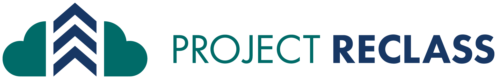
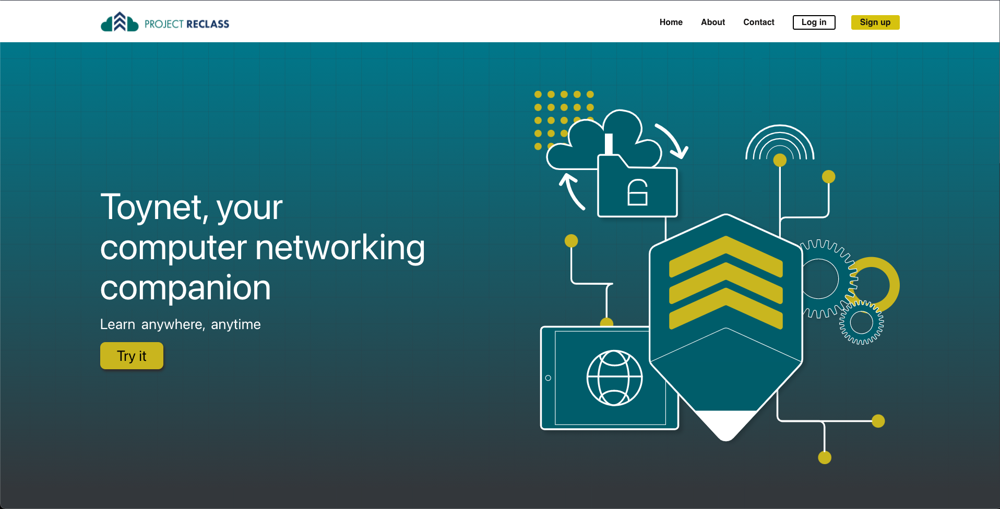

# [](https://mattermost.org)

Check out your new networking buddy [https://www.toynet.projectreclass.org](https://www.toynet.projectreclass.org)

Project Reclass is a multi-disciplinary nonprofit organization that teaches technical skills to incarcerated veterans. Learn more at [projectreclass.org](https://projectreclass.org).

[](https://toynet.projectreclass.org)

## Get Involved

* [Get Involved](https://www.projectreclass.org/get-involved/)
* [Contribute Code](https://docs.projectreclass.org/toynet/contributing-code-to-toynet/contributing-code-to-toynet)
* [See "Help Wanted" Tickets](https://github.com/Project-Reclass/toynet-react/issues?q=is%3Aopen+is%3Aissue+label%3A%22help+wanted%22)
* [Check out some of out other projects](https://github.com/orgs/Project-Reclass/repositories)

## Getting Started

The easiest way to get ToyNet up and running is by using the docker-compose. This requires [Docker](https://docs.docker.com/get-docker/), [Docker Compose](https://docs.docker.com/compose/install/), and [git](https://git-scm.com/downloads) to be installed. Our `docker-compose.yml` file will start each service necessary for using ToyNet on your machine in a production setup.

To get started, first download the [`docker-compose.yml`](https://git-scm.com/downloads) file.

For Linux with `wget`

```bash
wget https://raw.githubusercontent.com/Project-Reclass/toynet-react/master/docker-compose.yml
```

For Windows with Powershell

```powershell
wget https://raw.githubusercontent.com/Project-Reclass/toynet-react/master/docker-compose.yml -Outfile docker-compose.yml
# or
Invoke-WebRequest https://raw.githubusercontent.com/Project-Reclass/toynet-react/master/docker-compose.yml -Outfile docker-compose.yml
```

Then to start each ToyNet
```bash
docker-compose up --build -d # use -d to run in the background
```

## License

See the [LICENSE file](LICENSE) for mor information.

## Follow Us

* [Twitter](https://twitter.com/ProjectReclass)
* [Facebook](https://www.facebook.com/projectreclass)
* [LinkedIn](https://www.linkedin.com/company/reclass/)
* [Blog](https://www.projectreclass.org/digest/)

## Contributing

Check out our [CONTRIBUTING guide](CONTRIBUTING.md)!


